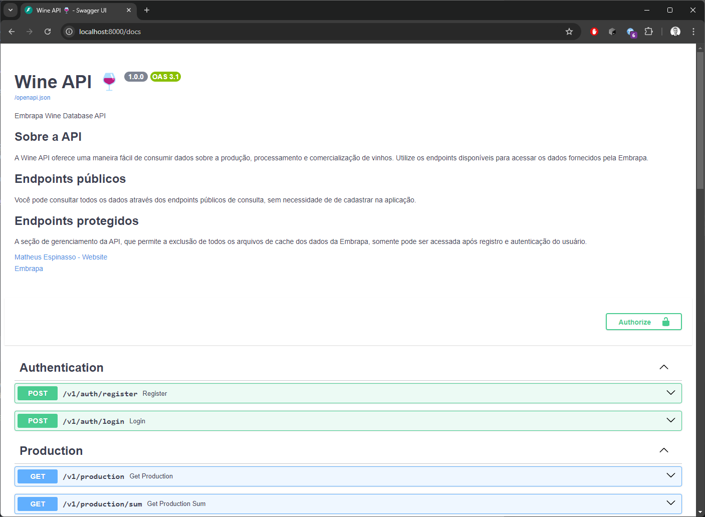

# Wine API 🍷


API não oficial e com fins acadêmicos para consulta de dados disponibilizados no site da
[Embrapa](http://vitibrasil.cnpuv.embrapa.br/).

## Executando a API

Você pode utilizar compilar o código fonte e executar a API em sua máquina, mas, para efeitos de praticidade, e também
para simplificar um futuro deploy, foi gerada uma imagem Docker e um arquivo `docker-compose.yml`.

É necessário apenas ter uma conexão com a internet e executar o comando `docker-compose up -d` no terminal de sua
máquina, na pasta raiz do projeto, onde está o arquivo `docker-compose.yml`.
A imagem será baixada [desse registro público do Docker Hub](https://hub.docker.com/r/mespinasso/fiap-wine-api/tags),
onde foi disponibilizada.

Uma vez que o comando tenha sido executado com sucesso, você poderá explorar os endpoints da API através de sua página
de documentação Swagger, que pode ser acessada em `http://localhost:8000/docs`.

Ao terminar o uso da API, você pode interromper a sua execução executando no mesmo diretório raíz o comando 
`docker-compose stop`. Após alguns segundos, a execução será finalizada.



A página é interativa e te permite executar chamadas em cada um dos endpoints da API apenas navegando pelos botões.

## Endpoints disponíveis

### Consulta de dados

Os dados fornecidos pela API são os mesmos disponibilizados no site da Embrapa, que englobam o período de 1970 ao ano
anterior ao atual, e incluem:

- **Produção** de vinhos, sucos e derivados (em litros): _Production_
- Quantidade de uvas **processadas** (em quilos): _Processing_
- **Comercialização** de vinhos e derivados (em litros): _Commerce_
- **Importação** de derivados de uva (em quilos e dólares americanos): _Imports_
- **Exportação** de derivados de uva (em quilos e dólares americanos): _Exports_

Para cada grupo de endpoints você encontrará uma busca de dados simples, que trará a série bruta de dados dentro
do intervalo de datas que você informar, e uma busca sumarizada, que trará a soma das quantidades dentro do período de
tempo que você informar.

Mais detalhes você encontra [na seção de exemplos](#exemplos-de-consumo-da-api) desse documento.

#### Parâmetros de consulta

Na página de documentação, você encontrará listados os parâmetros disponíveis para cada endpoint. Eles te permitem
filtrar dados de acordo com data, categoria do produto, país de origem/destino e outros.

Nenhum parâmetro tem preenchimento obrigatório. Alguns deles já propõe valores iniciais que você pode alterar, como no
caso das datas.

| Nome do parâmetro | Função                                                                            | Obrigatoriedade | Valores possíveis                                       | Observações                                |
|-------------------|-----------------------------------------------------------------------------------|-----------------|---------------------------------------------------------|--------------------------------------------|
| floor_year        | Definir o primeiro ano do intervalo de consulta                                   | Opcional        | Entre 1970 e o ano anterior ao atual                    | Trará o intervalo máximo se não preenchido |
| ceiling_year      | Definir o último ano do intervalo de consulta                                     | Opcional        | Entre 1970 e o ano anterior ao atual                    | Trará o intervalo máximo se não preenchido |
| category          | Filtro de categoria de produto                                                    | Opcional        | Consulte a tabela de refêrencia ao final do documento   |                                            |
| country_name      | Filtro de país de/para onde o produto foi importado/exportado                     | Opcional        | Consulte as tabelas de referência ao final do documento |                                            |
| clear_cache       | Permite forçar a limpeza do arquivo de cache usado por aquele endpoint específico | Opcional        | `true` ou `false`                                       | Mais detalhes sobre cache abaixo           |

### Administração do cache

Além dos endpoints de consumo de dados, há um endpoint de administração da aplicação, que permite limpar todos os
arquivos mantidos em cache local.

Ao consumir dados da API, são criados e mantidos na aplicação arquivos de cache com os dados da Embrapa. Esse cache
serve para melhorar o desempenho da API e garantir maior disponibilidade dos dados.

Caso haja a necessidade de eliminar o cache para garantir que a API forneça os dados mais recentes da Embrapa, o
endpoint de limpeza pode ser utilizado. Esse endpoint está protegido por uma autenticação usando tokens JWT.
Certifique-se de utilizar o endpoint de registro de usuário para se cadastrar e o endpoint de login para obter um token
de acesso, antes de executar chamadas contra o endpoint de administração.

- Registro e **autenticação** de usuários: _Authentication_
- **Administração** do cache da aplicação: _Administration_

## Exemplos de consumo da API

A consulta abaixo traz a produção de vinhos categorizados como "finos" apenas no ano de 2020.

```bash
curl -X 'GET' \
  'http://localhost:8000/v1/production?floor_year=2020&ceiling_year=2020&category=vv' \
  -H 'accept: application/json'
```

A consulta abaixo traz a soma do volume e do valor em USD das exportações de vinho para o Canadá entre os anos de 2010
e 2020.

```bash
curl -X 'GET' \
  'http://localhost:8000/v1/exports/wine/sum?floor_year=2010&ceiling_year=2020&country_name=Canad%C3%A1' \
  -H 'accept: application/json'
```

## Glossário

Abaixo uma relação de termos e significados que podem facilitar a compreensão da API e dos dados trazidos por ela.

| Termo                      | Significado                |
|----------------------------|----------------------------|
| Wine                       | Vinho                      |
| Wine grapes                | Uvas viníferas             |
| American and hybrid grapes | Uvas americanas e híbridas |
| Table grapes               | Uvas de mesa               |
| Declassified grapes        | Uvas sem classificação     |
| Sparkling wine             | Espumante / vinho frizante |
| Table wine                 | Vinho de mesa              |
| Juice                      | Suco                       |
| Raisins                    | Uvas passas                |

## Parâmetros de consulta

Detalhamento dos valores possíveis para os parâmetros de consulta da API.

### category

| Valor | Significado   |
|-------|---------------|
| vm    | Vinho de mesa |
| vv    | Vinho fino    |
| su    | Suco          |
| de    | Derivados     |

### country

#### Importação

| País                 |
|----------------------|
| Argélia              |
| Argentina            |
| Brasil               |
| Chile                |
| Colômbia             |
| Egito                |
| Espanha              |
| Estados Unidos       |
| Grécia               |
| Itália               |
| México               |
| Peru                 |
| Paraguai             |
| Portugal             |
| Panamá               |
| Reino Unido          |
| Uruguai              |
| Venezuela            |
| Não consta na tabela |
| Outros               |

#### Exportação

| País                               |
|------------------------------------|
| África do Sul                      |
| Alemanha, República Democrática da |
| Angola                             |
| Antígua e Barbuda                  |
| Antilhas Holandesas                |
| Arábia Saudita                     |
| Argélia                            |
| Argentina                          |
| Aruba                              |
| Austrália                          |
| Áustria                            |
| Bahamas                            |
| Bangladesh                         |
| Barbados                           |
| Barein                             |
| Bélgica                            |
| Belize                             |
| Benin                              |
| Bermudas                           |
| Birmânia                           |
| Bolívia                            |
| Cabo Verde                         |
| Camarões                           |
| Canadá                             |
| Catar                              |
| Cayman, Ilhas                      |
| Chile                              |
| China                              |
| Chipre                             |
| Cingapura                          |
| Colômbia                           |
| Congo                              |
| Coreia do Sul                      |
| Costa do Marfim                    |
| Costa Rica                         |
| Coveite                            |
| Cuba                               |
| Curaçao                            |
| Dinamarca                          |
| Dominica, Ilha de                  |
| El Salvador                        |
| Emirados Árabes Unidos             |
| Equador                            |
| Espanha                            |
| Estados Unidos                     |
| Falkland (Malvinas)                |
| Filipinas                          |
| Finlândia                          |
| França                             |
| Gana                               |
| Gibraltar                          |
| Granada                            |
| Grécia                             |
| Guatemala                          |
| Guiana                             |
| Guiana Francesa                    |
| Guiné Bissau                       |
| Guine Equatorial                   |
| Haiti                              |
| Hong Kong                          |
| Hungria                            |
| Ilha de Man                        |
| India                              |
| Indonésia                          |
| Irã                                |
| Iraque                             |
| Irlanda                            |
| Israel                             |
| Itália                             |
| Iugoslâvia                         |
| Jamaica                            |
| Japão                              |
| Líbano                             |
| Libéria                            |
| Líbia                              |
| Luxemburgo                         |
| Malásia                            |
| Malta                              |
| Marshall, Ilhas                    |
| Mauritânia                         |
| México                             |
| Moçambique                         |
| Mônaco                             |
| Montenegro                         |
| Namíbia                            |
| Nigéria                            |
| Noruega                            |
| Nova Caledônia                     |
| Nova Zelândia                      |
| Países Baixos                      |
| Panamá                             |
| Paquistão                          |
| Paraguai                           |
| Peru                               |
| Polônia                            |
| Porto Rico                         |
| Portugal                           |
| Quênia                             |
| Reino Unido                        |
| República Centro Africana          |
| República Dominicana               |
| República Federativa da Rússia     |
| Rússia                             |
| São Tomé e Príncipe                |
| Senegal                            |
| Serra Leoa                         |
| Singapura                          |
| Sri Lanka                          |
| Suécia                             |
| Suíça                              |
| Suriname                           |
| Tailândia                          |
| Taiwan (Formosa)                   |
| Tanzânia                           |
| Tcheca, República                  |
| Togo                               |
| Toquelau                           |
| Trinidade e Tobago                 |
| Turquia                            |
| Uruguai                            |
| Vanuatu                            |
| Venezuela                          |
